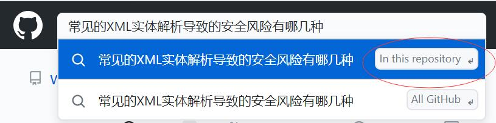
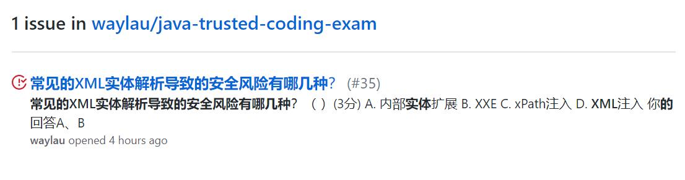

# Java Trusted Coding Exam. Java安可认证阶段考试/Java可信编码实现/Java面试题库

这是一个关于Java编程的题库，可用于安可认证阶段考试、可信编码实现、Java面试等。所有的题目都归档到了<https://github.com/waylau/java-trusted-coding-exam/issues>中。

## 如何搜题

#### 1. 在本仓库搜索框输入关键字

#### 2. 查看匹配到关键字issue列表

#### 3. 打开issue

issue会详细列出题目和答案。issue有两种状态：

* Closed：说明题目已经有明确的答案了。
* Open：说明题目还没有明确的答案了。

## 如何补充题库

补充题库，就是在<https://github.com/waylau/java-trusted-coding-exam/issues>中创建一个新的issue。

添加前最好先搜索下，是否已经有人提了类似的问题。如果是，请不要重复提交。

如果所补充的题目，有明确的答案，请在issue中将答案列出来，并将issue状态置为Closed；否则置为Open，这样就会有其人来帮助解答。

一个人的力量是有限的，欢迎大家一起群策群力。

## 互助群

加群（1134403647）方式如下：

#### 方式1：PC端直接点击下面链接

#### 方式2：手机端扫下面二维码

## 联系作者

您也可以直接联系我：

* 博客：https://waylau.com
* 邮箱：[waylau521(at)gmail.com](mailto:waylau521@gmail.com)
* 微博：http://weibo.com/waylau521
* 开源：https://github.com/waylau

## 开源捐赠

捐赠所得所有款项将用于开源事业！见[捐赠](https://waylau.com/donate)列表。